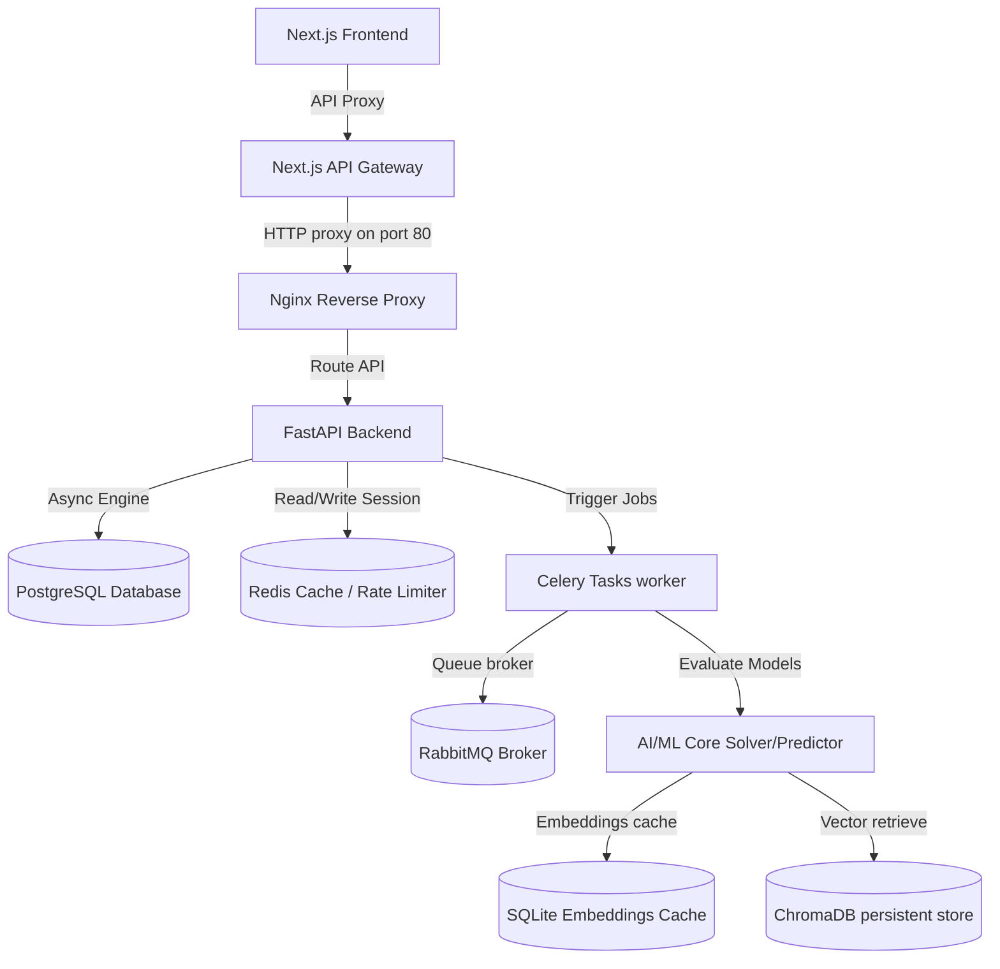

# CampaignOS - Enterprise AI Marketing Intelligence Platform

[](https://fastapi.tiangolo.com)
[](https://nextjs.org)
[](https://www.postgresql.org)
[](https://redis.io)
[](https://docs.celeryq.dev)
[](https://www.docker.com)

**CampaignOS** is an enterprise-grade Micro-SaaS platform that automates complex digital marketing workflows with Applied Artificial Intelligence. It leverages a decoupled, multi-container architecture containing a Next.js client, a high-performance FastAPI server, async database queries, background workers, dynamic time-series forecasting, and budget optimization solvers.

---

## 📖 Detailed Sub-Guides

For deep-dive documentation, please consult the dedicated READMEs:
*   📚 **[Backend Developer Guide](file:///Users/shanipratapsingh/Downloads/campaign-os/backend/README.md)**: DB Schema, REST Endpoints, OAuth2, Caching, background Celery tasks, and Swagger.
*   🧠 **[AI/ML Engineering Guide](file:///Users/shanipratapsingh/Downloads/campaign-os/ai-ml/README.md)**: AutoML pipeline, SLSQP & Genetic Solvers, LLM integrations, cached embeddings, vector stores, RAG, and drift audits.

---

## 🏗️ System Architecture

CampaignOS uses a multi-tier microservice architecture:



---

## 📁 Repository Structure

```
.
├── backend/                  # FastAPI web server, async database, models, Celery tasks
│   ├── app/                  # REST routers, security modules, database configuration
│   ├── migrations/           # Alembic async migration files
│   └── README.md             # Backend Developer Guide
│
├── ai-ml/                    # Machine Learning modeling, forecasting, RAG, vector store
│   ├── optimization/         # SLSQP & Genetic Algorithm budget allocators
│   ├── forecasting/          # Time-series projection models
│   ├── rag/                  # Chunking and semantic retrieval
│   └── README.md             # AI Engineering Guide
│
├── nginx/                    # Production reverse proxy configuration
├── Dockerfile                # Frontend Next.js production build file
└── docker-compose.yml        # Orchestrates the multi-container architecture
```

---

## ✨ Features

*   🔐 **Enterprise Auth**: Stateless JWT, secure password hashing, refresh tokens, role-based controls (Admin, Manager, Viewer).
*   🚀 **Budget Optimization**: Computes optimal allocations using continuous SLSQP programming and tourney selection Genetic Algorithms.
*   📈 **Time-Series Forecasting**: Simulates dynamic 10-day budget returns under logistical diminishing return metrics.
*   🧠 **LLM & RAG Integration**: Embeddings-cached retrieval over ad copy guidelines via ChromaDB and Gemini/OpenAI interfaces.
*   ⚙️ **Background AutoML Pipeline**: Schedules parallel training compared across Random Forest, XGBoost, and linear models using Celery.
*   📊 **Monitoring & Drift**: Live Prometheus scrapers, health probes, Kolmogorov-Smirnov data drift tests, and PSI prediction drift audits.

---

## 🛠️ Tech Stack

*   **Frontend**: Next.js 16, React 19, Tailwind CSS, Recharts
*   **Backend**: FastAPI, Python 3.12, SQLAlchemy 2.0 Async, Alembic, Gunicorn
*   **Databases**: PostgreSQL (Relational), Redis (Cache & Rate-limiting), ChromaDB (Vector)
*   **Task Queue**: Celery, RabbitMQ Broker
*   **Deployment**: Docker, Docker Compose, Nginx

---

## 🚀 Getting Started

### Prerequisites
*   Node.js 20+
*   Python 3.12+
*   Docker & Docker Compose

### Environment Variables
Copy `.env.example` in the root folder and fill in your cloud keys:
```bash
cp .env.example .env
```

---

## 📦 Run with Docker (Recommended)

To compile and launch all database containers, caching nodes, workers, Nginx proxies, and client interfaces:
```bash
docker compose up --build -d
```
Access the application at `http://localhost/` (Nginx port 80 proxy).

---

## 💻 Local Development Setup

### Running Frontend
```bash
npm install
npm run dev
# Serves client at http://localhost:3000
```

### Running Backend
```bash
cd backend
python3.12 -m venv venv
source venv/bin/activate
pip install -r requirements.txt
alembic upgrade head
uvicorn app.main:app --reload --port 8000
```

### Running AI/ML Worker
Ensure Redis and RabbitMQ are running, then start the Celery background worker:
```bash
cd backend
source venv/bin/activate
PYTHONPATH=.:../ai-ml celery -A app.core.celery_app worker --loglevel=info
```

---

## 📡 API Overview

| Endpoint | Method | Role Allowed | Description |
| :--- | :--- | :--- | :--- |
| `/api/v1/auth/login` | `POST` | Public | Standard JWT Password Login |
| `/api/v1/campaigns/` | `GET/POST`| Manager, Viewer | Manage Organization campaigns |
| `/api/v1/optimize/` | `POST` | Manager | Solve budget allocations |
| `/api/v1/simulate/` | `POST` | Viewer | Simulate ad spend trajectory |
| `/api/v1/ml/train` | `POST` | Manager | Trigger AutoML training task |

---

## 🖼️ Screenshots

| Campaign Dashboard | Budget Optimizer Slider |
| :---: | :---: |
|  |  |

---

## 🤝 Contributing
Contributions are welcome. Please read our guidelines and check tests before submitting pull requests.

## 📄 License
This project is licensed under the Apache 2.0 License.
