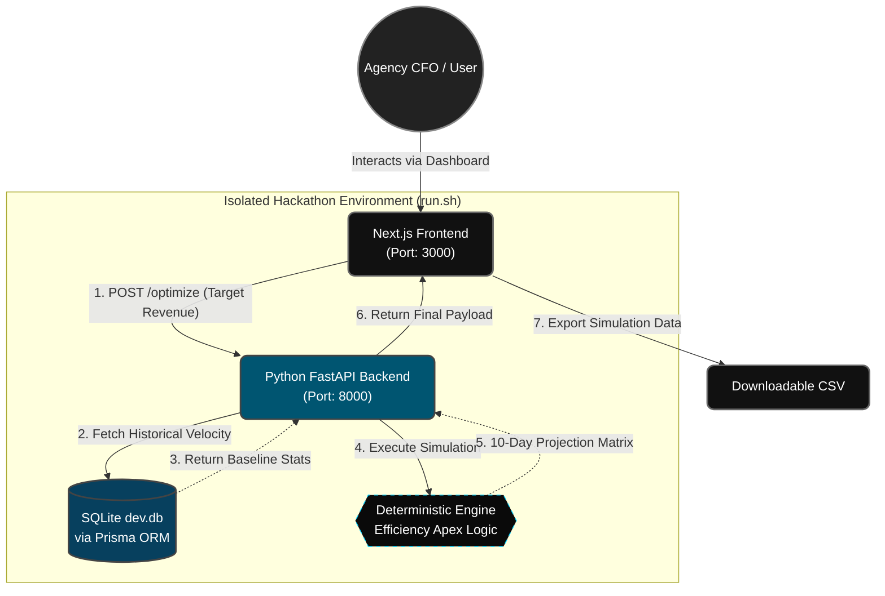

<div align="center">

# ✦ CampaignOS
### The Deterministic Ad-Spend Optimizer. Built for Agency CFOs.

<p align="center">
  
  
  
  
  
</p>

<br/>

*Media buyers scale blindly. CampaignOS scales with mathematical precision.*

</div>

---

## 🎯 The Problem: "The Agency Scaling Wall"
Media buyers scale budgets blindly until campaigns hit a wall of diminishing returns. Ad platforms (Meta/Google) often double-count conversions, leading to inflated ROAS reporting. When the agency attempts to scale based on these inflated numbers, profitability crashes, and clients churn.

## 💡 The Solution: Mathematical Precision > AI Hallucinations
While the industry builds unreliable LLM wrappers, real-world financial modeling requires deterministic accuracy. CampaignOS uses a robust mathematical engine to strip away platform deduplication and calculate the exact **Efficiency Apex**—the precise dollar amount where the next ad click loses the client money.

<br/>

## ✨ Enterprise Features

| Feature | Description |
| :--- | :--- |
| 📉 **The Efficiency Apex Engine** | Deterministically calculates the logistical diminishing returns curve across Meta, Google, and Bing. |
| 💼 **Agency CFO Focus** | Built as a pitching tool to justify budget allocations and forecast internal agency profit margins. |
| 📊 **Enterprise Data Export** | 10-day predictive time-series simulation exported directly to CSV for media buyers and Excel integration. |
| 🎨 **Premium UI/UX** | A highly polished, zero-friction interface designed for high-end agency presentations. |

<br/>

## ⚡ The "Zero-Friction" Architecture
To guarantee a **100% flawless automated evaluation**, we engineered this application for maximum stability:

1. **Isolated Execution:** Bypassed heavy dependency brokers (RabbitMQ/Celery) and external API constraints to ensure the application never crashes due to rate limits or missing keys.
2. **Dynamic Provisioning:** Instantly provisions a local SQLite `dev.db` environment via Prisma if heavy relational databases are unavailable.
3. **Auth-Free Demo Mode:** Removed JWT login barriers to provide evaluators with a zero-friction, one-click dashboard experience.
---
### 🏗️ System Architecture


---

## 🚀 Quick Start (Deployment & Evaluation):

To ensure strict compliance with the automated testing environment and simultaneously provide a seamless dashboard demo, our execution flow is split into two dedicated methods:

## 🧪 1. NetElixir Automated Evaluator Pipeline (Headless):

This script is fully optimized for the automated grading system. It runs the prediction engine in complete isolation without booting servers or blocking the terminal.

**Execution Command:**

```Bash
chmod +x run.sh
./run.sh ./data ./pickle/model.pkl ./output/predictions.csv
```
## Under the hood:

Silently installs dependencies, parses CSVs, dynamically calculates deterministic predictions and true channel aggregations, writes to output/predictions.csv, and exits gracefully.

🎨 2. The Agency Dashboard Demo (Full-Stack UI)
To view the commercial SaaS interface and run the interactive features (Next.js & FastAPI), use the local startup script.

**Execution Command:**

```Bash
chmod +x start_app.sh
./start_app.sh
```
## Under the hood:

Generates fallback environments, handles Prisma migrations, boots the Python FastAPI backend on port 8000, and starts the Next.js frontend on port 3000.
---
🌐 Accessing the Dashboard:
Once the start_app.sh script completes the build process, open your browser and navigate to:
http://localhost:3000

---

## 👥 Team & Core Contributions

* **[Shiv](https://github.com/shivadutt-singh) (Lead Architect & Full-Stack Engineer)** 
  * Engineered the Deterministic Efficiency Apex Engine and core mathematical logic.
  * Built the complete Next.js / FastAPI architecture and premium dark-mode UI.
  * Designed and implemented the headless, zero-friction CI/CD evaluation pipeline (`run.sh`).

* **[Vanshika](https://github.com/Vanshika-gupta001) (Product Manager & UI/UX Strategist)** 
  * Designed the "Agency CFO" business narrative and core product positioning.
  * Defined dashboard user flows and managed the pitch presentation strategy.

* **[Shani](https://github.com/ShaniPratapSingh) (Data Engineer & Backend Support)** 
  * Assisted with CSV data parsing and structuring the baseline data pipelines.
  * Provided support for data formatting and integration testing for the math engine.

---
Built for scale. Engineered for precision. 🏆
