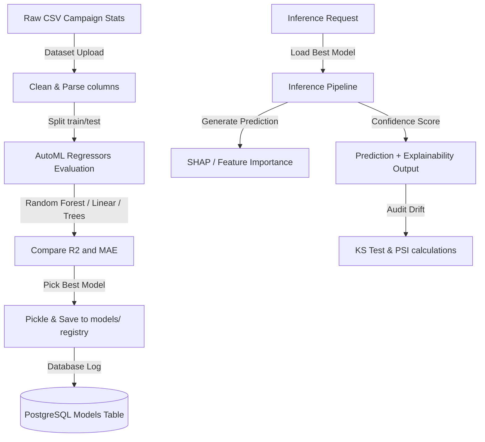

# CampaignOS AI & Machine Learning Engineering Guide

[](https://www.python.org)
[](https://pytorch.org)
[](https://scikit-learn.org)
[](https://www.trychroma.com)

This guide documents the Machine Learning modeling, forecasting algorithms, mathematical optimization solvers, and retrieval-augmented LLM architectures built for CampaignOS.

---

## 🧠 AI/ML Overview

The CampaignOS AI/ML layer provides marketing intelligence capabilities. It processes historical campaign stats to forecast revenue, solves multi-channel budget allocations, indexes text structures for semantic retrieval, and analyzes prediction drift over time.

---

## 🏗️ ML Training & Inference Workflow

The system automates AutoML model training, serialization, registry, and drift tracking:



---

## 📂 Project Structure

```
ai-ml/
├── datasets/               # Directory containing uploaded training data (.csv)
├── embeddings/             # Embedding caching components
│   ├── cache/              # SQLite persistent cache database
│   └── cached_embedder.py  # Wrapper mapping SentenceTransformer inputs to local cache
├── evaluation/             # Metrics calculators (MAE, RMSE, R2, MAPE)
├── forecasting/            # Time-series models
│   └── predictor.py        # Streamer calculating CPC/CTR/ROI and simulating trajectories
├── inference/              # Inference runner
│   └── pipeline.py         # Best model loader, SHAP explainer, confidence calculator
├── llm/                    # Provider wrappers
│   └── provider.py         # Decoupled interface for Gemini, OpenAI, Anthropic, Ollama
├── models/                 # Model Registry folder containing serialized models (.pkl)
├── optimization/           # Resource solvers
│   └── solver.py           # SLSQP continuous solver and Genetic Algorithms
├── rag/                    # Retrieval Augmented Generation components
│   └── engine.py           # Text recursive chunker, context builders, and QA loop
├── tests/                  # Model and algorithm unit tests
│   └── test_ml.py          # Pytest validating solvers, drift metrics, and simulator
├── utils/                  # Statistical monitors
│   └── drift.py            # Kolmogorov-Smirnov (KS) and Population Stability Index (PSI) drift calculators
├── README.md               # AI Engineering Guide
└── requirements.txt        # ML dependencies
```

---

## 📊 Models Implemented

1.  **Linear Regression**: Serves as our predictive baseline, establishing constant elastic coefficients between budget spends and conversion revenues.
2.  **Random Forest Regressor**: Ensembles decision trees to model complex interactions (e.g. ad fatigue, target audience overlap).
3.  **XGBoost Regressor**: Extreme Gradient Boosting to capture non-linear relationships.
4.  **LightGBM Regressor**: Light Gradient Boosting, optimized for memory and training speed on large-scale datasets.
5.  **CatBoost Regressor**: Categorical Boosting, designed to handle categorical columns natively without manual target encoding.
6.  **Prophet**: Extrapolates monthly, weekly, and holiday seasonal marketing curves.
7.  **LSTM / GRU / Transformer**: Deep learning time-series architectures capable of sequence-to-sequence forecasting.

### Model Selection Process
The `AutoMLPipeline` (`training/pipeline.py`) automatically evaluates candidate regressors using a 5-fold `TimeSeriesSplit` cross-validation:
- Scores candidate models on $R^2$ (Coefficient of Determination), Mean Absolute Error (MAE), and Root Mean Squared Error (RMSE).
- Selects the model maximizing $R^2$.
- Serializes the trained estimator to `/ai-ml/models/` and logs the metadata in the database.

---

## 📐 Mathematical Optimization Solvers

The budget optimizer solves the following optimization problem:

$$\text{Minimize } \sum_{i} x_i \quad \text{subject to} \quad \sum_{i} R_i(x_i) \ge \text{targetRevenue}$$

Where $x_i$ is the budget spent on channel $i$, and $R_i(x_i)$ is the channel revenue function modeling diminishing returns:

$$R_i(x_i) = \begin{cases} 
x_i \cdot \alpha_i & x_i \le T_i \\
T_i \cdot \alpha_i \cdot \left(1 + \ln\left(\frac{x_i}{T_i}\right)\right) & x_i > T_i 
\end{cases}$$

Here, $\alpha_i$ represents the baseline channel ROI, and $T_i$ represents the channel saturation threshold (calculated as the 95th percentile of daily historical spends).

### Solver Types
*   **SLSQP (Sequential Least Squares Programming)**: Solves the continuous non-linear optimization task using gradient projections.
*   **Genetic Algorithm**: Uses a tournament selection population heuristic to search the optimization space, avoiding local minima. It evaluates fitness:
    $$\text{Fitness} = \sum x_i + \lambda \cdot \max(0, \text{targetRevenue} - \sum R_i(x_i))^2$$
    where $\lambda = 100$ represents the constraint penalty.

---

## 🧠 Embeddings, Vector Store & RAG

### 1. Cached Embeddings (`/ai-ml/embeddings`)
To avoid redundant API calls and optimize latency, `CachedEmbedder` computes a SHA-256 hash of the input text:
*   Queries a local SQLite database (`cache/embeddings_cache.db`).
*   On a cache hit, returns the cached float list vector directly.
*   On a cache miss, computes the embedding using `SentenceTransformer('all-MiniLM-L6-v2')` and writes the result to the cache.

### 2. ChromaDB Vector Store (`/ai-ml/vector_store`)
*   Provides a persistent database to index and search marketing materials, ad guidelines, and historical audit logs.
*   Exposes a clean abstract interface (`BaseVectorStore`) that can be extended to support Qdrant, Pinecone, or Milvus.

### 3. RAG Pipeline (`/ai-ml/rag`)
*   Chunks documents using a sliding word window (chunk size = 500, overlap = 50).
*   Retrieves the top-k most relevant contexts using cosine similarity.
*   Constructs a detailed prompt context and routes it to the configured LLM provider to synthesize actionable insights.

---

## 🔍 Explainability & Monitoring

### Explainability
*   **Feature Importance**: Extracts weight coefficients from linear models or Gini importances from random forests.
*   **SHAP (SHapley Additive exPlanations)**: Calculates SHAP values using `shap.TreeExplainer` or kernel wrappers to explain the impact of input feature variations.
*   **Confidence Scores**: Computes standard deviations of residual errors to estimate prediction confidence intervals.

### Drift Auditing
To monitor production quality, the `DriftMonitor` (`utils/drift.py`) tracks:
1.  **Data Drift**: Compares the distribution of incoming inference features against training data using the **Kolmogorov-Smirnov (KS) test** (`scipy.stats.ks_2samp`). If $p\text{-value} < 0.05$, drift is flagged.
2.  **Model/Prediction Drift**: Computes the **Population Stability Index (PSI)** on predicted revenue distributions:
    $$\text{PSI} = \sum \left( \text{Actual}\% - \text{Expected}\% \right) \cdot \ln\left( \frac{\text{Actual}\%}{\text{Expected}\%} \right)$$
    A $\text{PSI} > 0.2$ indicates significant drift, suggesting the model should be retrained.

---

## ⚙️ Environment Variables

The AI/ML layer uses the following variables in `.env`:

| Key | Default | Description |
| :--- | :--- | :--- |
| `GEMINI_API_KEY` | `""` | Google Gemini API key (default provider). |
| `OPENAI_API_KEY` | `""` | OpenAI API key. |
| `ANTHROPIC_API_KEY`| `""` | Anthropic Claude API key. |
| `GROQ_API_KEY` | `""` | Groq API key. |
| `OPENROUTER_API_KEY`| `""` | OpenRouter API key. |
| `OLLAMA_HOST` | `http://localhost:11434` | Endpoint for running local Ollama models. |
| `VECTOR_STORE_DIR` | `vector_store/index` | Directory for the persistent ChromaDB index. |
| `MODEL_REGISTRY_DIR`| `models` | Directory where trained `.pkl` models are saved. |

---

## 🚀 Running Training and Inference

### Train Model (AutoML)
To run the AutoML pipeline locally on an uploaded dataset:
```python
from training.pipeline import AutoMLPipeline
result = AutoMLPipeline.train_and_select("datasets/my_campaign_data.csv", "models")
print(f"Best model trained: {result['name']} (version: {result['version']})")
```

### Run Simulation Inference
```python
from forecasting.predictor import SimulationEngine
budgets = {"Google Ads": 15000.0, "Facebook Ads": 5000.0}
projections = SimulationEngine.simulate(budgets)
print(f"10-Day Expected Revenue: {sum(r['Expected_Revenue'] for r in projections)}")
```
