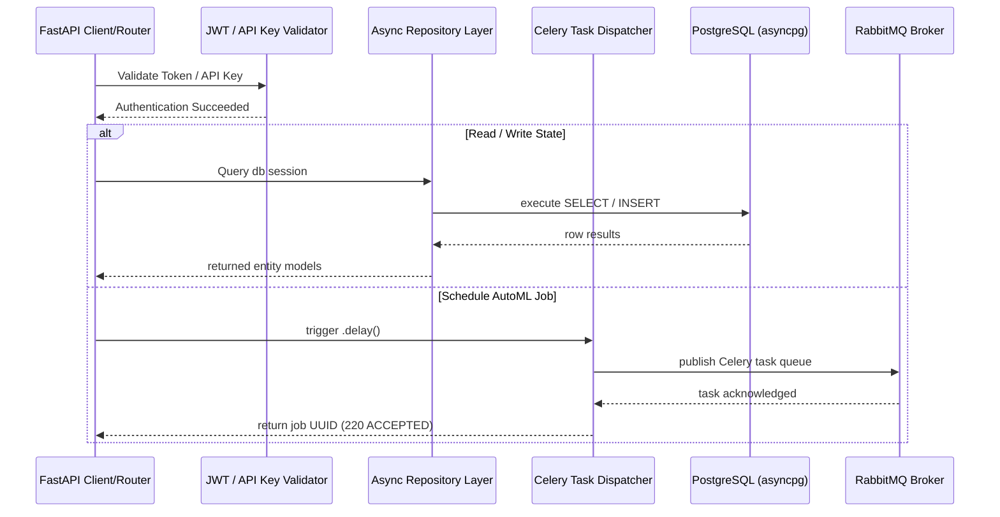

# CampaignOS Backend Developer Guide

[](https://fastapi.tiangolo.com)
[](https://www.postgresql.org)
[](https://redis.io)
[](https://docs.celeryq.dev)

This documentation provides the technical blueprint and reference guide for developing, testing, deploying, and scaling the FastAPI backend for CampaignOS.

---

## 📖 Backend Overview

The CampaignOS backend serves as the core business logic gatekeeper and API gateway. It provides transactional database reads/writes, secure state persistence, background model-training orchestration, rate limiting, stateless token authorization, and health diagnostics.

---

## 🏗️ Architecture & Flow

The backend exposes an asynchronous RESTful API layer interacting with PostgreSQL via SQLAlchemy 2.0 Async engines and triggers long-running CPU-bound ML computations using Celery via RabbitMQ.



---

## 📂 Folder Structure

```
backend/
├── app/
│   ├── api/                    # API Router registration
│   │   ├── deps.py             # FastAPI dependency injections (get_db, current_user, RoleChecker)
│   │   └── v1/                 # Versioned router routers
│   │       ├── auth.py         # Login, registrations, API key creation routers
│   │       ├── campaigns.py    # CRUD Campaign and session save endpoints
│   │       ├── datasets.py     # CSV uploads and analysis handlers
│   │       ├── health.py       # Live Prometheus metrics and component check handlers
│   │       ├── ml.py           # Model registry list and training trigger endpoints
│   │       ├── optimize.py     # Channel budget SLSQP allocation wrappers
│   │       └── simulate.py     # Spend trajectory forecasting wrappers
│   ├── core/
│   │   ├── config.py           # Pydantic BaseSettings loading .env variables
│   │   ├── database.py         # AsyncSessionDeclarative base database managers
│   │   ├── security.py         # Bcrypt pass hashing and JWT signing helpers
│   │   └── celery_app.py       # Celery client configurations
│   ├── models/
│   │   └── models.py           # SQLAlchemy database schemas mapping 22 tables
│   ├── repositories/
│   │   ├── base.py             # Generic repository class wrapping CRUD operations
│   │   └── entities.py         # User, Org, Campaign repositories subclasses
│   ├── schemas/
│   │   └── schemas.py          # Pydantic schemas validating REST shapes
│   ├── services/
│   │   └── auth_service.py     # Registration, login checks, API Key validation services
│   └── tasks.py                # CPU-bound Celery background tasks
│
├── migrations/                 # Alembic environment and schema migrations
│   ├── versions/               # Generated database migration files
│   ├── env.py                  # Alembic async migration environment
│   └── script.py.mako          # Alembic generator python template
├── alembic.ini                 # Alembic configurations
├── Dockerfile                  # Production container builder
└── requirements.txt            # Python requirements (FastAPI + ML packages)
```

---

## 🛠️ Technologies & Packages

*   **FastAPI**: Asynchronous web framework.
*   **SQLAlchemy 2.0 & Asyncpg**: Async DB engine and session client.
*   **Alembic**: Database migrations management.
*   **Pydantic V2**: Extreme performance request/response schemas.
*   **Celery & Pika**: Multi-thread worker node executing background ML tasks.
*   **Redis**: High-speed memory database for caching and rate limiting.
*   **Passlib (Bcrypt)**: Secure password hashing.
*   **python-jose**: JWT signature validation.

---

## 📐 Design Patterns

*   **Repository Pattern**: Isolates database queries inside `BaseRepository`, providing a clean async CRUD interface.
*   **Service Layer**: Encapsulates auth and registration logic away from endpoint handlers inside `AuthService`.
*   **Dependency Injection**: Exposes reusable FastAPI dependencies (e.g. `get_db`, `get_current_user`, `RoleChecker`).
*   **Lifespan Context Manager**: Automates startup events (superuser checking and seeding) inside `Lifespan`.

---

## 🔒 Security Features

*   **Stateless Authentication**: Signed JWT access tokens with short TTLs (60 mins) and persistent refresh tokens.
*   **Role-Based Access (RBAC)**: Custom `RoleChecker` restricting endpoints to specific tiers (`Admin`, `Manager`, `Viewer`).
*   **API Key Management**: Encrypted machine-to-machine calls using custom `X-API-Key` headers stored as SHA-256 hashes in PostgreSQL.
*   **CORS**: Secure middleware restrictiveness configuration.
*   **SQL Injection Preventative**: All database transactions are parameterized via SQLAlchemy's select constructs.

---

## 📡 API Documentation & Examples

Swagger docs are served at `http://localhost:8000/docs` and Redoc at `http://localhost:8000/redoc`.

### Authentication

#### 1. Register User & Organization
`POST /api/v1/auth/register`
```bash
curl -X POST "http://localhost:8000/api/v1/auth/register" \
     -H "Content-Type: application/json" \
     -d '{"email": "manager@test.com", "password": "SecurePassword123!", "role": "Manager"}'
```
Response:
```json
{
  "email": "manager@test.com",
  "role": "Manager",
  "is_active": true,
  "id": "2af7a7f4-8a48-43d9-9520-22c608f654b1",
  "organization_id": "b3e34b9d-5bc3-488f-9a74-d2e8316c02ef",
  "created_at": "2026-07-09T08:28:00"
}
```

#### 2. OAuth2 Password Login (Get JWT Token)
`POST /api/v1/auth/login`
```bash
curl -X POST "http://localhost:8000/api/v1/auth/login" \
     -H "Content-Type: application/x-www-form-urlencoded" \
     -d "username=manager@test.com&password=SecurePassword123!"
```
Response:
```json
{
  "access_token": "eyJhbGciOiJIUzI1NiIsIn...",
  "refresh_token": "eyJhbGciOiJIUzI1NiIsIn...",
  "token_type": "bearer"
}
```

---

### Campaign Management

#### 3. Save Campaign Session
`POST /api/v1/campaigns/save`
```bash
curl -X POST "http://localhost:8000/api/v1/campaigns/save" \
     -H "Content-Type: application/json" \
     -d '{"budgets": {"Google Ads": 12000, "Facebook Ads": 4000}, "projectedRevenue": 82000, "roi": 5.1}'
```
Response:
```json
{
  "success": true,
  "id": "e8a34b22-832f-4883-9b6f-44e21a221fb0"
}
```

---

### Budget Optimization & Projections

#### 4. Run Budget Allocation Optimizer
`POST /api/v1/optimize/`
```bash
curl -X POST "http://localhost:8000/api/v1/optimize/" \
     -H "Content-Type: application/json" \
     -d '{"targetRevenue": 100000}'
```
Response:
```json
{
  "target_revenue": 100000,
  "total_recommended_budget": 24500,
  "allocations": {
    "google_ads": 10000,
    "meta_ads": 8000,
    "bing_ads": 6500
  },
  "saturation_warning": true,
  "warning_message": "Google Ads reached historical saturation point. Overflow budget reallocated to Meta Ads."
}
```

#### 5. Run Spend Simulator
`POST /api/v1/simulate/`
```bash
curl -X POST "http://localhost:8000/api/v1/simulate/" \
     -H "Content-Type: application/json" \
     -d '{"Google Ads": 10000, "Facebook Ads": 5000}'
```
Response:
```json
[
  {
    "Date": "2026-07-09",
    "Channel": "All Channels",
    "Expected_Revenue": 63450.2,
    "Best_Case": 78900.5,
    "Worst_Case": 49100.1,
    "AI_Insight": "AI Insight: Optimal performance detected within bounds."
  }
]
```

---

## 🗄️ Database Schema Mapping

CampaignOS maps **22 relational tables** inside PostgreSQL:
1.  `users`: logins, salted passwords, and role designations.
2.  `organizations`: corporate ownership groupings.
3.  `sessions`: JWT refresh tokens and lifecycle limits.
4.  `api_keys`: SHA-256 hashed keys for machine-to-machine integrations.
5.  `campaigns`: parent marketing details (names, dates, total budgets).
6.  `channels`: specific channel descriptors (Google Ads, Meta Ads, etc.).
7.  `campaign_metrics`: daily logs of spend, clicks, and revenue.
8.  `predictions`: outputs stored by target prediction dates.
9.  `optimization_runs`: recommendations generated by budget seekers.
10. `simulation_runs`: multi-day spend scenarios saved by slider page.
11. `insights`: performance anomalies and growth suggestions.
12. `recommendations`: automated channel budget actions.
13. `models`: saved ML algorithms version paths and accuracy scores.
14. `datasets`: uploaded CSV training files, metadata, and schemas.
15. `training_jobs`: Celery state runners (pending, training, completed).
16. `inference_logs`: latency, inputs, and outputs of execution runs.
17. `audit_logs`: security record tracking (user email, action, IP).
18. `notifications`: alerts generated for target users.
19. `system_logs`: application error, warning, and trace files.
20. `feature_flags`: dynamic switch toggles for testing.
21. `user_activities`: usage metrics for platform auditing.

---

## ⚙️ Environment Variables

The backend relies on the following configurations in `.env`:

| Key | Default | Description |
| :--- | :--- | :--- |
| `PROJECT_NAME` | `CampaignOS Backend` | The API name shown in swagger. |
| `SECRET_KEY` | `super-secret-key...` | Cryptographic secret for signing JWTs. |
| `ACCESS_TOKEN_EXPIRE_MINUTES`| `60` | JWT access token lifetime in minutes. |
| `REFRESH_TOKEN_EXPIRE_DAYS`| `7` | Session refresh token limit in days. |
| `POSTGRES_SERVER` | `localhost` | Host address of PostgreSQL server. |
| `POSTGRES_USER` | `postgres` | Admin user for the database. |
| `POSTGRES_PASSWORD` | `postgres` | Password for DB connection. |
| `POSTGRES_DB` | `campaignos` | Database name. |
| `POSTGRES_PORT` | `5432` | Postgres listening port. |
| `REDIS_HOST` | `localhost` | Cache server endpoint. |
| `REDIS_PORT` | `6379` | Cache server port. |
| `RABBITMQ_HOST` | `localhost` | Message broker host. |
| `RABBITMQ_PORT` | `5672` | Broker listening port. |
| `FIRST_SUPERUSER_EMAIL`| `admin@campaignos.com`| Initial superuser created on startup. |
| `FIRST_SUPERUSER_PASSWORD`| `AdminCampaignOS123!`| Password for the initial superuser. |

---

## 📈 Performance & Scaling Guide

*   **Uvicorn workers**: Run FastAPI using Gunicorn with 2-4 Uvicorn workers in production to leverage multi-core processors.
*   **Database connection pooling**: Explicitly configured connection limits (`pool_size=10`, `max_overflow=20`) to prevent DB query exhaustion under concurrent client loads.
*   **Stateless background offloading**: Celery delegates CPU-bound ML model fitting away from the web process loop, maintaining 10ms web API responses.
*   **Redis Caching**: Cache expensive optimization responses to prevent redundant solver calls for identical targets.
*   **Async First**: All database actions use Python's `async/await` syntax, allowing the server to handle high numbers of concurrent web socket connections.
