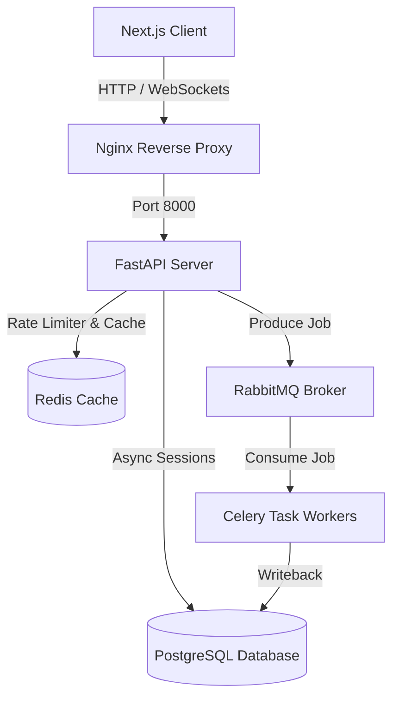

# CampaignOS Backend: Developer Guide

This directory houses the FastAPI enterprise backend orchestration server for CampaignOS. It handles campaign lifecycle states, token authorization, background cron jobs, and database interactions, and acts as the secure API gateway for the Next.js client.

---

## 🏗️ Architecture Overview

The backend uses a layered, asynchronous Repository-Service architecture built with FastAPI and SQLAlchemy 2.0.



### Key Components:
- **`app.main`**: Application entrypoint configuring CORS, middleware, routers, WebSockets, and health checks.
- **`app.api.v1`**: Versioned API endpoints (auth, campaigns, datasets, health, models, optimization, simulations, and real-time feeds).
- **`app.core`**: Global configuration settings, database engines, security schemas, Celery setup, and feature store.
- **`app.models`**: SQLAlchemy models declaring core entities (Users, Campaigns, OptimizationRuns, PromptTemplates).
- **`app.repositories`**: Abstract and concrete database access layers for clean CRUD separation.
- **`app.services`**: Core business domain logic (authentication, password hashing, and state workflows).

---

## 📂 Folder Structure

```
backend/
├── Dockerfile                # Production multi-stage Docker build
├── requirements.txt          # Python packages list
├── alembic.ini               # Database migrations configuration
├── README.md                 # This file
├── app/
│   ├── main.py               # Main FastAPI runner
│   ├── api/                  # API routers
│   │   ├── deps.py           # Dependency injections (database sessions, auth tokens)
│   │   └── v1/               # Router v1 endpoints
│   ├── core/                 # App configurations and core database/security setups
│   │   ├── config.py         # Pydantic Settings
│   │   ├── database.py       # SQLAlchemy engine and declarative base
│   │   ├── celery_app.py     # Celery configuration & beat schedule mappings
│   │   ├── feature_store.py  # Moving averages, CPC/CTR, and trend utilities
│   │   └── security.py       # Password hashing & JWT helper functions
│   ├── models/               # SQLAlchemy DB entities
│   ├── repositories/         # Database access layer (CRUD helpers)
│   ├── schemas/              # Pydantic input/output serializers
│   ├── services/             # Core workflows and authentication services
│   ├── tasks.py              # Celery background workers tasks definitions
│   └── tests/                # Pytest unit and integration suite
└── migrations/               # Alembic database migration versions
```

---

## ⚙️ Requirements & Prerequisites

- **Python**: version `3.12+`
- **PostgreSQL**: version `15+` (with `asyncpg` compatibility)
- **Redis**: version `7.0+` (caches & rate limiting)
- **RabbitMQ**: version `3.10+` (background task broker)
- **Docker & Compose** (optional, for containerized environments)

---

## 🚀 Installation & Local Setup

### 1. Create a Virtual Environment
Navigate to the `backend` directory and create/activate a clean environment:

```bash
# macOS/Linux
cd backend
python3.12 -m venv .venv
source .venv/bin/activate

# Windows (Command Prompt)
cd backend
python -m venv .venv
.venv\Scripts\activate.bat

# Windows (PowerShell)
cd backend
python -m venv .venv
.venv\Scripts\Activate.ps1
```

### 2. Install Package Dependencies
Install all backend packages:
```bash
pip install --upgrade pip
pip install -r requirements.txt
```

### 3. Setup Local Environment File
Create a `.env` file inside the `backend` directory (use `backend/.env.example` as a template):
```bash
cp .env.example .env
```

Set the local database connection. To run local unit tests or lightweight servers without Postgres, you can specify SQLite:
```env
# Local SQLite Testing config
DATABASE_URL="sqlite+aiosqlite:///./campaignos.db"
```

### 4. Apply Database Migrations
Run Alembic upgrades to generate the database schema tables:
```bash
alembic upgrade head
```

---

## ⚡ Running the Backend Server

Start the Uvicorn development server:
```bash
# Reload flag enables hot-reloads on file edits
PYTHONPATH=. uvicorn app.main:app --reload --host 0.0.0.0 --port 8000
```

Once running, verify connectivity:
- **Interactive Documentation (Swagger UI)**: [http://localhost:8000/docs](http://localhost:8000/docs)
- **Redoc Documentation**: [http://localhost:8000/redoc](http://localhost:8000/redoc)
- **Prometheus Metrics**: [http://localhost:8000/metrics](http://localhost:8000/metrics)

---

## 📋 API Registry & Examples

### Health Check Endpoint
Returns database connectivity, Redis connection, and RabbitMQ health logs.
- **URL**: `GET /api/v1/health/`
- **cURL Example**:
```bash
curl -X GET http://localhost:8000/api/v1/health/
```

### Campaign Budget Optimization
Optimizes allocations under target ROI constraints using continuous solver engines.
- **URL**: `POST /api/v1/optimize/`
- **cURL Example**:
```bash
curl -X POST http://localhost:8000/api/v1/optimize/ \
     -H "Content-Type: application/json" \
     -d '{"targetRevenue": 100000}'
```

### Performance Simulation
Runs simulated daily performance forecasting runs.
- **URL**: `POST /api/v1/simulate/`
- **cURL Example**:
```bash
curl -X POST http://localhost:8000/api/v1/simulate/ \
     -H "Content-Type: application/json" \
     -d '{"Google Ads": 15000.0, "Facebook Ads": 10000.0}'
```

---

## 🧪 Running Tests
Verify backend logic and SQLite fallback configurations:
```bash
# Add PYTHONPATH to search path
PYTHONPATH=. pytest app/tests/ -v
```

---

## 🐋 Docker Container Commands

Orchestrate the backend under Docker compose:

```bash
# Build and run containers in detached mode
docker compose up -d backend celery_worker

# Stream backend container logs
docker compose logs -f backend

# Tear down backend and clear volumes
docker compose down -v
```

---

## 🔧 Troubleshooting FAQ

### 1. `ValueError: greenlet library is required`
**Cause**: The PostgreSQL driver or async runner is using SQLAlchemy async features without the python `greenlet` dependency.
**Solution**: Run `pip install greenlet` inside your active virtual environment.

### 2. `UnsupportedCompilationError: SQLite cannot compile type JSONB`
**Cause**: Test suites are running on SQLite, which doesn't support PG-specific `JSONB` columns.
**Solution**: Our system uses a custom `SQLJSON` type decorator that intercepts compiling dialects. Ensure models use `SQLJSON` rather than raw `sqlalchemy.dialects.postgresql.JSONB`.

### 3. Database connection fails with `role "postgres" does not exist`
**Cause**: The local Postgres daemon is running, but the user/password configuration or port allocation does not match the default `.env` parameters.
**Solution**: Modify the `POSTGRES_USER` and `POSTGRES_PASSWORD` parameters inside your `.env` file to match your native Postgres roles, or switch to local sqlite for testing.
